&emsp;&emsp;*CAN(Controller Area Network,控制器局域网)是一种串行通信技术，专门用于在汽车电子控制单元(ECU)之间实现可靠的数据交换。*

### CAN的起源
&emsp;&emsp;起初，独立运行的ECU足以实现电子功能。但工程师们很快就意识到，ECU彼此协调工作可以极大地增强车辆功能。最初，ECU之间数据交换是以传统方式实现的，即为每一个传输信号分配一个物理通信通道。然而，大量的布线也只能实现有限的数据交换。唯一可以解决这一难题的方法是通过单个通信通道（总线）进行串行位数据交换。因此，需要设计适合汽车需求的串行通信系统。

&emsp;&emsp;上世纪八十年代初，[**Bosch**](./零散的专业知识.md)开发一种新的串行通信系统，即CAN。即使在今天，CAN汽车动力系统、底盘和舒适系统的ECU网络中发挥着重要作用。最重要的是，CAN具有数据传输非常可靠的特点，可以满足应用领域的实时要求。

&emsp;&emsp;自引入CAN后，汽车中的复杂线束（通常存在多种变体）已成为过去。CAN不仅可以简化项目规划和实施，还可以降低布线重量和空间要求。

两种方式的区别如下图所示：

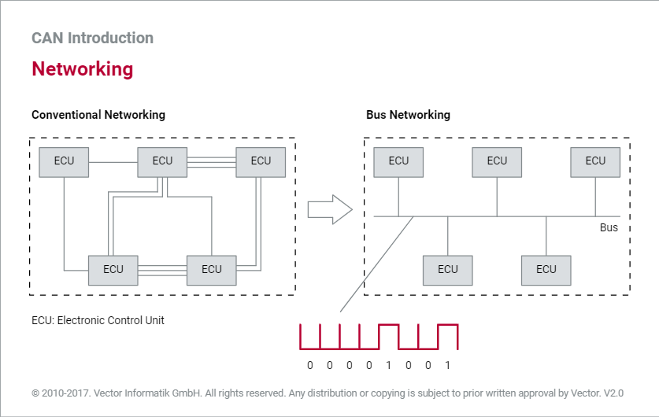

### CAN协议基本介绍
#### 标准化
&emsp;&emsp;从1994年开始，ISO启动CAN技术标准化工作，并最终形成4份标准规范。其中，ISO 11898-1描述了CAN协议。除了数据通信的参考模型，CAN协议仅包括数据链路层（介质访问控制子层MAC -Medium Access Control和逻辑链路控制子层LLC - Logical Link Control）和物理层（物理信号PLS - Physical Signaling）。

&emsp;&emsp;ISO 11898-2和ISO 11898-3介绍了数据通信参考模型的两个子层：PMA（Physical Medium Attachment，物理介质适配层）和PMS（Physical Medium Specification，物理介质规范）。它们描述了两种不同的CAN物理层：高速CAN物理层和低速CAN物理层，主要区别在于对总线电平和数据传输速率（波特率）的定义。

&emsp;&emsp;ISO 11898-3规定最大的波特率为125 kbit/s，主要用于汽车的舒适系统领域。ISO 11898-2规定最大波特率为1 Mbit/s，主要用于汽车的动力系统和底盘系统领域。

&emsp;&emsp;ISO 11898-1定义了事件驱动通信。总线负载较高可能会导致延迟，对于优先级较低的CAN报文来说尤其如此。若要确保在CAN网络中实现确定性通信，可以使用ISO 11898-4。ISO 11898-4是数据链路层的扩展，为CAN网络增加了时间触发的通信选项。

&emsp;&emsp;CAN协议是基于硬件实现的。目前有多种不同的CAN控制器，其唯一区别在于对CAN报文的处理方式，具体体现在对象层中：具有对象存储的CAN控制器（即完整CAN控制器-Full CAN Controller）与不具有对象存储的CAN控制器（即基础CAN控制器-Basic CAN Controller）。

&emsp;&emsp;下图显示了数据通信的ISO/OSI参考模型、CAN技术规范（CAN standard）及其实现之间的关系。

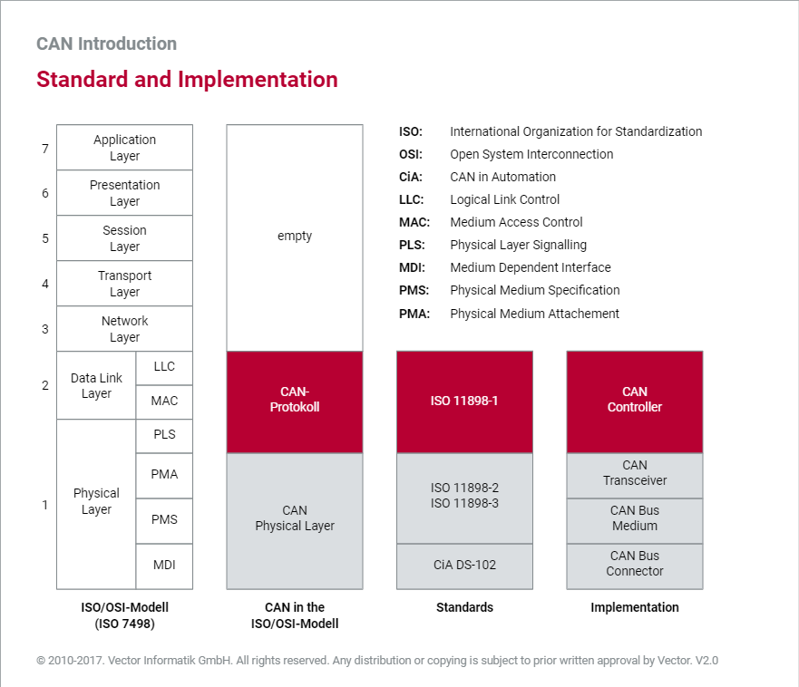

#### CAN网络

&emsp;&emsp;CAN网络由若干个经物理传输介质（CAN总线-CAN Bus）连接的CAN节点组成。实际上，CAN网络通常采用线性拓扑结构，每个ECU经CAN接口连接到总线。也有少数CAN网络采用被动星形拓扑。

&emsp;&emsp;物理传输介质使用[非屏蔽双绞线](./零散的专业知识.md)（UTP，Unshielded Twisted Pair）是传输[对称信号](https://baike.baidu.com/item/%E5%AF%B9%E7%A7%B0%E4%BF%A1%E5%8F%B7/5920132?fr=aladdin)时最常用的物理传输介质。通常，UTP的线横截面介于0.34 mm2 和0.6 mm2 之间。线路电阻应小于60 mΩ。

&emsp;&emsp;在最高传输速率1Mbit/s的情况下，允许的最大长度是40米。在CAN网络的末端，[总线终端电阻](./零散的专业知识.md)（termination resistor）有助于抑制信号反射现象。ISO 11898规定CAN节点的最大数量为32。

CAN网络结构如下图所示：

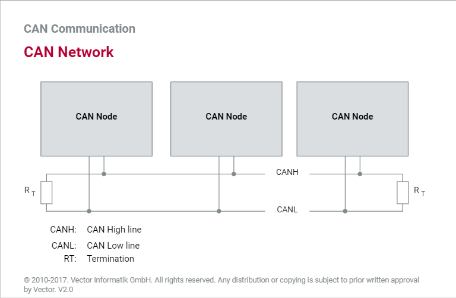

#### CAN节点

&emsp;&emsp;随着汽车电子化程度的提高，软件的数量和复杂度也在迅速增长。一些豪华汽车已经拥有1000多种软件功能，多条总线系统，以及70多个ECU。在CAN网络中执行任务的ECU称为CAN节点。

复杂度不断升高
&emsp;&emsp;在ECU联网的初期，一个简单的CAN驱动程序（该驱动程序为应用程序提供与硬件无关的简单接口）、一个CAN控制器和一个CAN收发器（CAN transceiver）足以实现CAN接口。如今，ECU网络离不开操作系统、网络管理和诊断功能。同时，软件已变得极其复杂，因此有必要对ECU基础软件进行标准化。

软件协调
&emsp;&emsp;标准统一的软件可减少开发工作并简化维护工作，还有助于提高重复使用率，并且有助于增强不同车辆平台之间以及[**OEM**](./零散的专业知识.md)和供应商之间的软件组件的互换性。

AUTOSAR
&emsp;&emsp;AUTOSAR（AUTomotive Open System ARchiteture，汽车开放系统架构）为ECU软件提供了参考架构，其核心是AUTOSAR实时运行环境（RTE），负责将网络与应用程序的软件组件完全分离。AUTOSAR以基础软件的形式为软件组件提供统一的服务，从低到高分别为：微控制器抽象层、ECU抽象层、服务层。

CAN节点结构
&emsp;&emsp;“CAN Node”图描述了新式CAN节点的结构。最值得关注的是“通信服务”领域。AUTOSAR COM（通信）提供标准通信服务、诊断服务（诊断COM管理器）和网络管理服务（通用NM/CAN NM）。PDU路由器（PDU：协议数据单元）处理各个通信层之间的内部节点通信，并协调AUTOSAR COM、诊断COM管理器和CAN TP（传输协议）之间的通信。

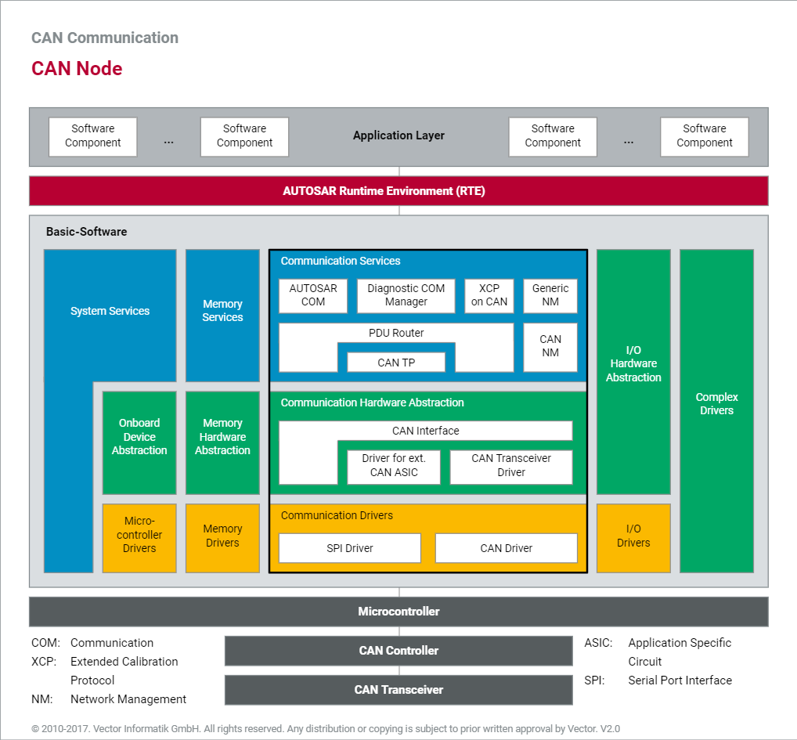

#### CAN控制器

CAN接口
&emsp;&emsp;ECU需要CAN接口才能参与CAN通信。CAN接口由CAN控制器和CAN收发器组成。CAN控制器执行CAN协议规定的通信功能，从而大大减轻了主机的负担。

CAN收发器
&emsp;&emsp;CAN收发器将CAN控制器连接到物理传输介质。通常，控制器和收发器之间采用[**光耦隔离或磁耦隔离**](零散的专业知识.md)，因此尽管CAN总线上的过电压可能会损坏CAN收发器，但CAN控制器和底层主机仍可受到保护。

发送/接收
&emsp;&emsp;在CAN网络中，CAN节点的不同之处在于每个节点发送或接收的CAN报文的数量。发送和接收的频率也存在很大差异。例如，一个CAN节点可能要接收五条不同的CAN报文，且每隔10毫秒接收一条，而另一个CAN节点只需每隔100毫秒接收一条CAN报文。这些明显的差异导致产生了两种基本的CAN控制器架构：完整CAN控制器和基础CAN控制器。

集成
&emsp;&emsp;不论CAN控制器类型如何，CAN控制器都可集成在微控制器中，也可以作为独立的芯片存在（如图所示）。在这种情况下，微控制器会将CAN控制器视为存储芯片。虽然独立CAN控制器更加灵活，但集成CAN控制器具有所需空间更少的优势，并且微控制器和CAN控制器之间的通信更快、更可靠。

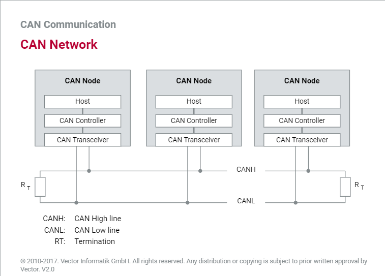

#### CAN收发器

总线连接
&emsp;&emsp;以前，CAN控制器经常通过离散电路连接到通信介质（CAN总线）。但现在，CAN收发器可以处理总线连接。CAN收发器有两个总线引脚：一个用于连接CAN高信号线（CANH），另一个用于连接CAN低信号线（CANL）。这是因为CAN采用对称的物理信号传输以满足[**电磁兼容性**](./零散的专业知识.md)，而且CAN网络中的物理传输介质是由两根线（非屏蔽双绞线）构成。

高/低速率
&emsp;&emsp;通常，高速CAN收发器和低速CAN收发器的物理电平不同，支持的数据传输速率也不同。高速CAN收发器支持的波特率高达1 Mbit/s。低速CAN收发器支持的波特率最高仅为125 kbit/s。但低速CAN收发器可确保总线接口的容错布局（例如，两条通信线路之中的某一条故障不会导致总体通信故障）。

收发器布局
&emsp;&emsp;下图显示了高速CAN收发器的基本布局。两个输出晶体管都处于截止状态时，CANH和CANL均具有相同的电位（0.5*Vcc），且差分电压为零。两个晶体管导通时会在CANH和CANL之间产生一个随负载电阻变化的差分电压。根据ISO 11898-2，该差分应为2V。因此，会产生约35 mA的电流。

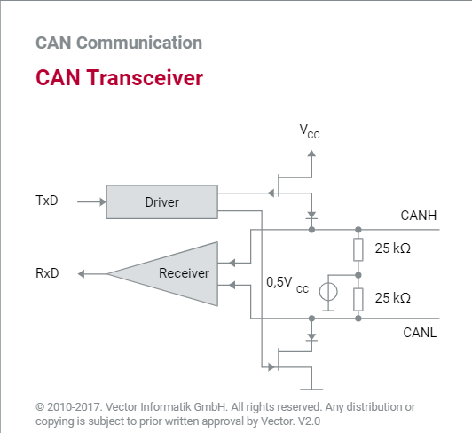

抗噪能力
&emsp;&emsp;通常，CAN收发器的电磁辐射极低且共模工作范围广，具有较高的抗噪能力。此外，目前的CAN收发器可提供高达8 kV的ESD（Electro-Static discharge，防静电）保护。尽管CAN收发器在某些应用领域中具有很高的[**共模抑制**](./零散的专业知识.md)，但在输出附近插入共模扼流圈（CMC）仍有助于进一步减少辐射，如下图所示。

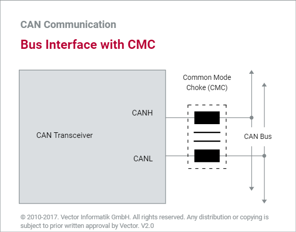

限制
&emsp;&emsp;ISO 11898中规定CAN节点的最大数量为32。实际上，CAN节点的最大数量在很大程度上取决于所使用的CAN收发器的性能以及CAN网络是高速还是低速。例如，如果在高速CAN网络中使用TJA1050高速CAN收发器，则在一个CAN网络中最多可以连接110个CAN节点。

#### CAN总线

差分信号（Differential signals）
&emsp;&emsp;CAN网络中的物理信号基于差分信号进行传输，有效地消除发动机、点火系统和开关触点引起的干扰电压所造成的负面影响。因此，传输介质（CAN总线）由两条线路构成：CAN高信号线（CANH）和CAN低信号线（CANL）。

双绞线
&emsp;&emsp;将两条导线绞成一股可显著减小磁场。因此，在实践中双绞线通常用作物理传输介质。

总线终端
&emsp;&emsp;由于信号传播速度有限，反射现象的影响会随着波特率提高和总线延长而增加。使用终端电阻连接通信通道的两端（模拟传输介质的电特性）可防止在高速CAN网络中发生反射。

&emsp;&emsp;总线终端电阻的关键参数是导线的特性阻抗。ISO11898-2（高速CAN）规定终端电阻是120欧姆，但ISO11898-3（低速CAN）未规定任何总线终端电阻，因为它的最大速率仅为125kbit/s。

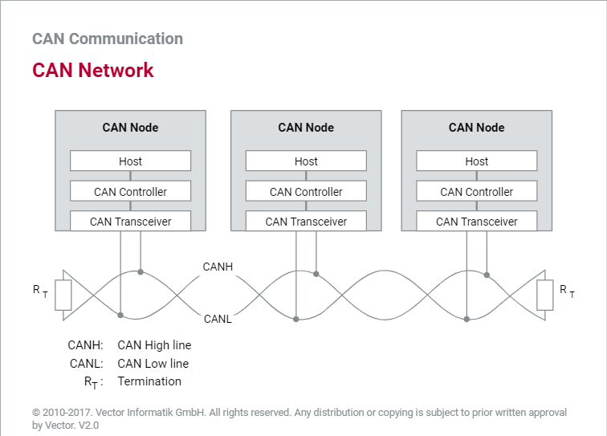

#### CAN总线电平

总线连接
&emsp;&emsp;CAN网络中的物理信号基于差分信号进行传输，具体的差分电压取决于所使用的总线接口。高速CAN总线接口（ISO 11898-2）和低速CAN总线接口（ISO 11898-3）有所不同。

电压等级
&emsp;&emsp;在ISO 11898-2中，逻辑“1”对应差分电压0V，逻辑“0”对应差分电压2V。高速CAN收发器将超过0.9V的差分电压当做共模工作范围（通常为-12V到12V之间）内的显性（dominant）电平。

&emsp;&emsp;低于0.5V的差分电压被当做隐性（recessive）电平。磁滞电路提高了抵抗干扰电压的能力。在ISO 11898-3中，逻辑“1”对应差分电压-5V，逻辑“0”对应差分电压2V。

&emsp;&emsp;“High-Speed CAN Bus Levels”图和“Low-Speed CAN Bus Levels”图说明了不同CAN总线上的电压关系。

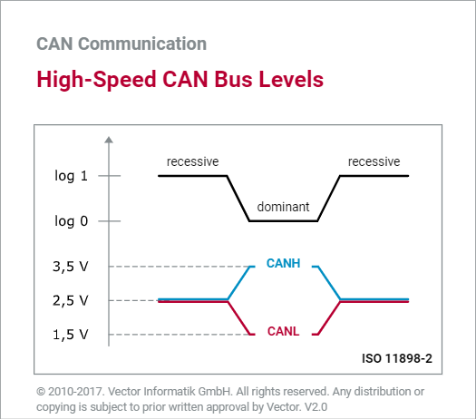
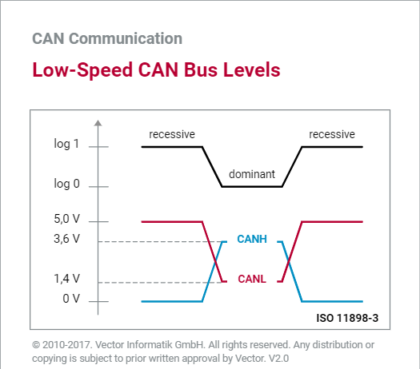

#### CAN总线逻辑

显性/隐性
&emsp;&emsp;在CAN网络中实现通信顺畅（尤其是总线访问、故障指示和应答）的基本前提是总线显性电平和总线隐性电平之间存在明显差别。总线显性电平对应于逻辑“0”，总线隐性电平对应于逻辑“1”。

&emsp;&emsp;显性电平优先级高于隐性电平。当不同CAN节点同时发送显性和隐性总线电平时，CAN总线将呈现显性总线电平。只有当所有CAN节点都发送隐性电平时，CAN总线才呈现隐性总线电平。

与逻辑
&emsp;&emsp;从逻辑上说，上述行为是与逻辑。从物理上讲，与逻辑由集电极开路电路实现。通过“Bus Logic”图可以了解CAN网络的线与（wired-AND）逻辑。

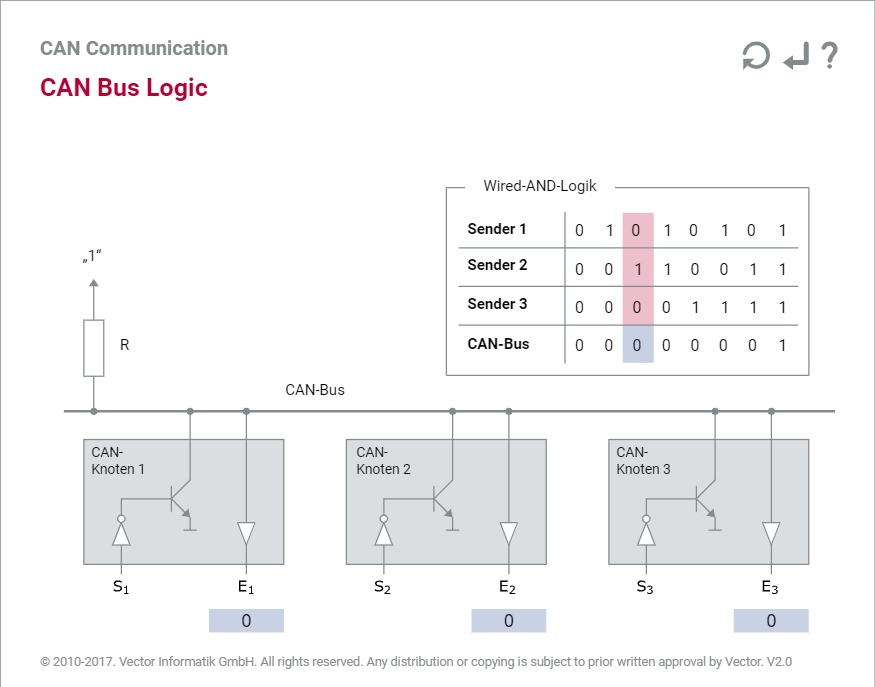

#### 通信原理

分散化
&emsp;&emsp;安全性关键应用（例如动力系统领域的应用）对通信系统的可用性提出了严格的要求。因此，让单个总线节点承担总线分配责任会造成不利影响。该总线节点易受攻击，且如果出现故障，将导致所有通信失败。最佳解决方案是分散总线访问权限，以便每个总线节点都能够访问总线。

事件驱动
&emsp;&emsp;CAN网络基于多主架构与总线型拓扑的原因是：每个CAN节点都可以发送报文至CAN总线上。CAN报文的传输不遵循任何预定的时间顺序，而是由事件驱动。
&emsp;&emsp;当传输信息时，通信通道才会处于繁忙状态，因此CAN节点可以非常快速地访问总线。理论上，由于可以快速响应异步事件且波特率高达1 Mbit/s，因此在CAN网络中完全可以实现毫秒级的实时数据传输。

接收方（receiver）选择寻址（addressing）
&emsp;&emsp;在CAN网络中，接收方选择寻址防止总线节点之间产生依赖，从而提高配置的灵活性：CAN报文是广播发送的，网络中所有CAN节点都可以接收到所有CAN报文。每个节点中都有过滤器，可以通过报文的标识符（ID）来筛选实际所需的CAN报文。虽然这会增加开销，但却可以在不修改CAN网络的情况下集成其他CAN节点。

CAN通信
&emsp;&emsp;通过[“CAN Communication Principle”动画](https://elearning.vector.com/mod/page/view.php?id=4819)可以了解如何在CAN网络中进行报文传输，以及如何使用CAN通信矩阵和接收过滤器。请阅读说明，以便充分利用动画中的全部功能。 “Typical CAN Communication”图显示了典型的通信顺序，包括构成CAN网络基础的通信矩阵，以及最终的接收和发送情况。

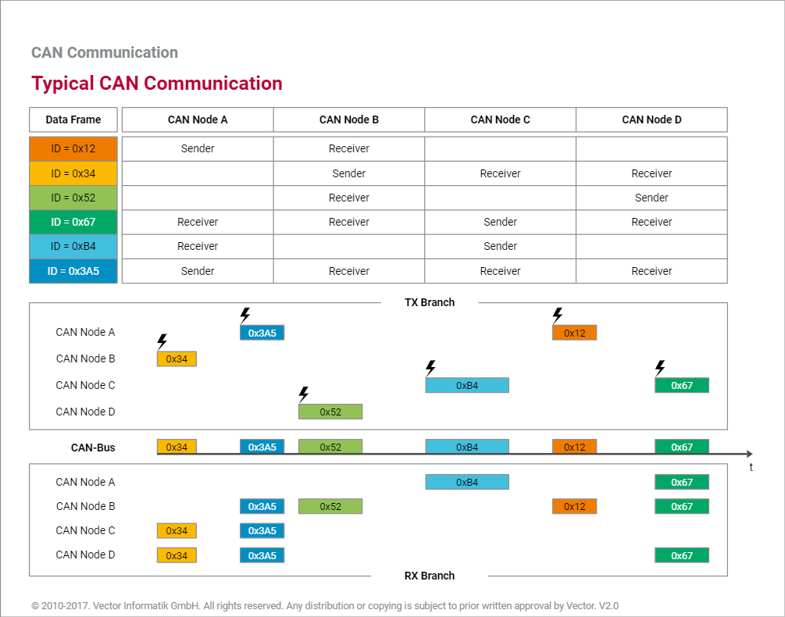

#### 帧类型
数据帧（Data frame）
为传输用户数据，ISO 11898-1定义了数据帧。数据帧可以传输的最大有效负载为八个字节，即数据场。除了数据场，数据帧还包括执行CAN通信协议所需的许多其他场，包括报文ID、数据长度代码（DLC）、校验场（循环冗余校验序列 - CRC序列）以及应答场（ACK）等。

远程帧（Remote frame）
通常ECU会通过数据帧主动发送相关数据，但某些情况也可能用到远程帧。使用远程帧可以从其他任何CAN节点请求用户数据（即数据帧）。除了缺少数据场以外，远程帧与数据帧结构相同。

错误帧（Error frame）
错误帧可用于指示通信期间检测到的错误。错误帧将强行中止正在进行的错误数据传输。错误帧的结构与数据帧或远程帧明显不同，仅由两部分构成：错误标志（error flag）和错误界定符。

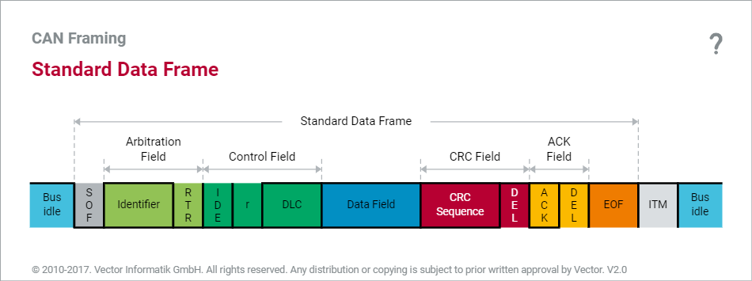
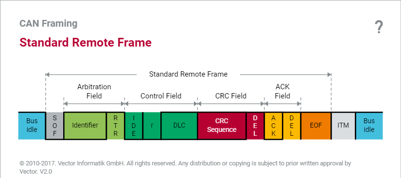

#### 数据帧
段
数据帧是传输用户数据的载体，CAN通信中的主要角色。数据帧由多种不同部分构成，每个部分都会在传输过程中执行一项重要任务。例如：启动并维护ECU节点之间的同步，建立通信矩阵中定义的通信关系，以及传输和保护用户数据。

SOF（Start of Frame，帧起始）
SOF是数据帧传输的起始位。发送方（sender）会发送一个显性电平作为SOF，由于总线空闲时总线会保持隐性电平，因此SOF发出后会产生一个跳变沿用于整个CAN网络的时间同步。为了在帧传输期间保持与发送方的同步，接收方会在所有隐性电平到显性电平的跳变沿进行是否与发送方保持同步的判断。如果出现偏差，接收方将按照相关相位误差量重新进行同步（重同步）。

ID和RTR（Remote Transmission Request，远程传输请求位）
SOF之后是标识符（ID），用于区分数据帧的优先级，并根据通信矩阵中定义的收发关系为节点中的接收过滤器提供过滤依据。ID之后是RTR位。发送方将其用于通知接收方帧的类型（数据帧或远程帧）。RTR位为显性表示数据帧，隐性则表示远程帧。

IDE（Identifier Extension bit，标识符扩展位）
IDE位用于区分标准格式和扩展格式。标准ID有11位，扩展ID有29位，“Physical Transfer of a Data Frame in Standard Format”图展示了这两种格式。

DLC（Data Length Code，数据长度代码）
DLC表示数据场中的有效负载的字节数。一个数据帧最多可以传输八个字节。

CRC（cyclic redundancy check，循环冗余校验码）和ACK（acknowledge，应答）
校验场使用以界定符（delimiter）为结尾的CRC来保护有效负载。接收方在ACK位做出肯定或否定的应答，ACK位后同样有一位界定符。

EOF
EOF由7个连续隐性位组成，在此之后，报文传输结束。

知识强化
为加深对CAN数据帧的理解，可以查看“Physical Transfer of a Data Frame in Standard Format”图并通过习题进行练习。该图显示了高速CAN网络中标准格式数据帧的物理传输。您可以尝试在布局练习中以正确顺序排列标准格式数据帧的所有部分。[点击这里，选最后一张图进行练习](https://elearning.vector.com/mod/page/view.php?id=4821)

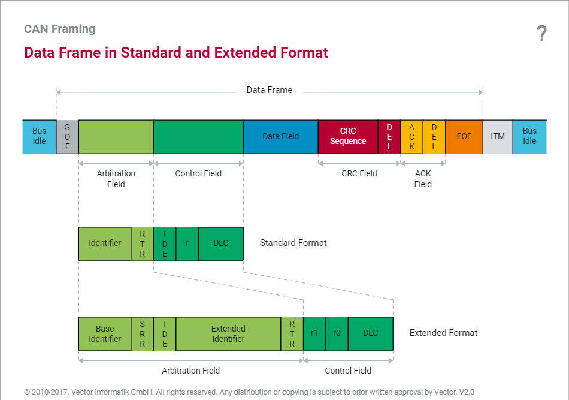
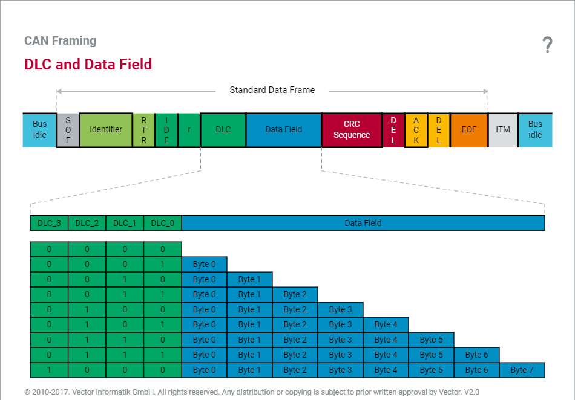
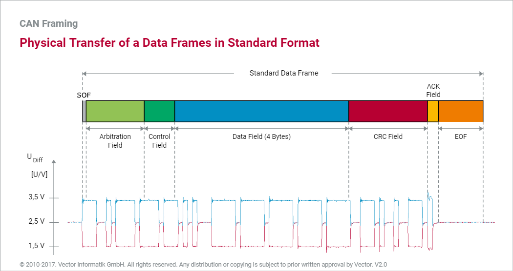

#### 远程帧
请求数据
远程帧用于从任何CAN节点请求数据（即数据帧）。但是数据传输并不基于请求，而是主要基于信息生产者的自我主动性，因此汽车应用程序中几乎不使用远程帧。远程帧支持标准格式和扩展格式。

通过RTR决定
除缺少数据场以外，远程帧与数据帧布局相同。数据帧和远程帧是以RTR位来区分的。数据帧的RTR位为显性，远程帧的RTR位则为隐性。

两种帧，
同一ID
原则上，可以为CAN网络中的所有数据帧定义远程帧，仅需确保远程帧的标识符与所关联数据帧的ID匹配。发送节点通过发送数据帧来响应远程帧。

远程帧和响应
如果CAN控制器具有对象存储，则该CAN控制器会自动响应远程帧。不具有对象存储的CAN控制器必须先让主机知道远程帧，然后才能发起响应。 在理想情况下，远程帧的请求会立即触发对应数据帧的响应。但在请求和响应之间可能会插入具有更高优先级的CAN报文。

#### 寻址
报文寻址
CAN网络中的通信基于与内容相关的寻址。CAN节点本身没有ID，但是可以通过ID区分CAN报文。所有CAN节点都会收到总线上广播发送的所有CAN报文。每个接收方都根据需求自行选择CAN报文。这种接收方选择寻址非常灵活，但需要每个接收方对接收到的CAN报文进行过滤（接收过滤）。

标准格式和扩展格式
用户可以选择以下两种报文格式：标准格式和扩展格式。两种格式的标识符长度不同。在标准格式中，ID有11位。在扩展格式中，ID有29位。

与标准格式ID相比，扩展格式ID由两个部分构成：基本ID和扩展ID。连接这两个部分的是IDE（Identifier Extension，标识符扩展）位和SRR（Substitute Remote Request，替代远程请求）位。

显性IDE位表示CAN报文为标准格式。隐性IDE位表示CAN报文为扩展格式。在扩展格式中，始终以隐性方式传输的SRR位取代了标准格式的RTR位，并且控制场的前两位（r0和r1）没有实际作用，两者都作为显性位传输。

#### CRC和应答
传输可靠性
串行通信在汽车环境中遇到的最大难题之一就是如何保证极高的传输可靠性。CAN总线中使用的CRC校验是功能最强大的错误检测方法之一。

CRC序列
CRC方法根据要传输的位（从SOF到数据场结束）和ISO 11898-1定义的生成多项式G（x）计算CRC序列。CRC序列位于数据场之后。接收方会采用同样的方法针对接收到的位（SOF开始到数据场结束）计算CRC并与接收到的报文中的CRC序列进行对比，这样可以非常可靠地检测是否发生了传输错误。（例外情况：当CRC序列本身遭到干扰破坏时）。

应答
根据计算后的结果，每个接收节点都会给出应答，与节点是否会过滤该报文无关。接收方的应答不是肯定就是否定。ACK 位中的显性电平表示肯定应答，隐性电平表示否定应答。

ACK界定符
为了进行错误跟踪，ACK界定符始终以隐性方式传输。由于发送方以隐性方式传输ACK 位和ACK界定符，因此一个肯定应答足以告知发送方报文已正确传输。这就是CAN网络中的应答方法被称为节点肯定应答的原因。

您可通过[交互式动画了解CAN网络中的应答](https://elearning.vector.com/mod/page/view.php?id=4824)。该图假设CAN网络中存在一个发送方和两个肯定应答的接收方。

ACK错误和错误标志
在有节点给出肯定应答的情况下，如果还有其他节点给出否定应答，那么这些否定应答不会被其他节点收到。为确保网络范围内的数据一致性，这些节点会在ACK界定符之后发送错误标志。

如果没有一个肯定应答，则ACK位会保持隐性，发送方将检测到ACK错误，并通过发送错误标志来终止正在进行的报文传输。ACK错误表示由发送方引起的错误或总线上没有接收方引起的错误。

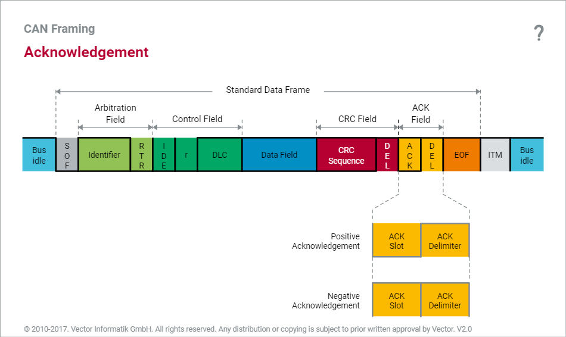

#### 位填充

同步
数据传输正确的基本前提是网络中通信节点之间同步。起始位（帧起始 - SOF）的隐性至显性的跳变沿用于同步CAN报文。之后，重同步（resynchronization）机制用于保持同步，直到报文传输结束为止。

重同步
重同步机制基于对隐性至显性跳变沿的评估。位填充机制保证了传输过程中有足够的跳变沿。ISO 11898-1规定，发送方在传输连续5个相同位后必须传输一个相反的位；即使连续5个相同位后本就是一个相反位，也需要添加填充位。

位填充区
由于位填充从以SOF的传输为开始，以CRC序列的最后一位的传输为结束，因此在传输包含8个数据字节的标准格式的数据帧时，在极限情况下，应有24个填充位。所以，理论上标准格式数据帧最多包含132位。

[“Bit Stuffing”图](https://elearning.vector.com/mod/page/view.php?id=4825)可以帮助您迅速理解位填充机制。

#### 总线访问原则

所有节点均可访问总线
ISO 11898-1定义了多主架构，以确保高可用性和事件驱动的数据传输。CAN网络中的每个节点都有权访问CAN总线，无需请求许可，也无需事先与其他CAN节点进行协调。虽然基于事件驱动的总线访问对事件的响应非常快，但也存在风险，即多个CAN节点可能同时访问CAN总线，从而导致CAN总线上出现数据重叠。

冲突避免
为保持通信系统的实时能力，ISO 11898-1规定了用于确保无损数据传输的总线访问， CSMA/CA（Carrier Sense Multiple Access with Collision Avoidance，载波监听多路访问/冲突避免）方法。CSMA/CA方法确保希望发送报文的CAN节点在CAN总线可用时才对其进行访问。

逐位总线仲裁
如果多个节点同时访问总线，基于逐位总线仲裁的CSMA/CA方法可确保发送最高优先级CAN报文的节点获得总线访问权。原则上，CAN报文的优先级越高，在CAN总线上的传输次序越靠前。如果系统设计不佳，可能导致低优先级的CAN报文永远无法发出。

[“ Principle of Bus Access”图](https://elearning.vector.com/mod/page/view.php?id=4826)可以帮助您更好地理解上述内容。图中假设两个CAN节点希望访问正在传输报文的总线。请阅读说明，以便充分利用图片中的全部功能。

#### 逐位总线仲裁

CSMA/CA
ISO 11898-1定义的总线访问方法的关键是逐位总线仲裁。即使多个节点同时访问总线，也可以防止发生冲突。逐位总线仲裁的原理相对简单。

唯一的总线电平
在网络范围内实现同步后，所有希望发送报文的CAN节点会将其CAN报文的ID从最高有效位到最低有效位逐位发送到CAN总线。在此过程中，CAN网络所基于的线与逻辑可确保在总线上产生清晰明确的总线电平。

仲裁逻辑
仲裁逻辑决定CAN节点是否可以继续发送，或者停止发送。[“ Bus Access Logic”图](https://elearning.vector.com/mod/page/view.php?id=4827)有助于加深了解逐位总线仲裁的机制。

每次一个发送方
仲裁阶段结束时，ID最小的CAN报文的发送节点获得总线访问权。试图发送较低优先级报文的CAN节点切换为接收状态，等待CAN总线再次可用时对其进行访问，以再次尝试发送。“ Bus Access Procedure”图说明了CAN节点在总线访问期间的所有操作。

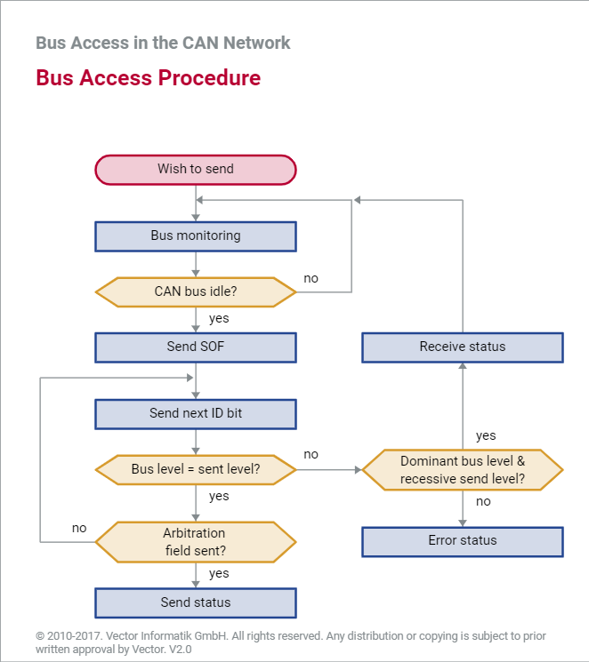

知识强化
“逐位总线仲裁”模拟可以帮助您加深对CAN网络中的总线访问的理解。该模拟基于三个希望进行发送的节点所构成的CAN网络。您可以自行设置这三个CAN节点发送的报文ID。

