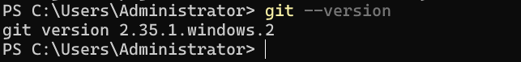

> 该文档为Git学习笔记，参考以下两个网站学习，与网站中内容颇为相似，只不过根据自己的理解和记忆特点进行了浓缩：
> 1. [Git操作可视化的学习网址](https://learngitbranching.js.org/?demo=&locale=zh_CN)
> 2. [廖雪峰的Git详细教程](https://www.liaoxuefeng.com/wiki/896043488029600)
## Git简介
&emsp;&emsp;Linus在1991年创建了开源的Linux操作系统，此后全球的业内人士共同向Linux操作系统贡献源码，不断升级优化，但刚开始大家贡献的源码都由Linus审核后人工手动录入，当时的Linus也考虑了使用版本控制系统，但一方面觉得SVN等免费的集中式版本控制系统不好用，还必须联网；另一方面觉得商用付费的版本控制系统与Linux的开源精神不符，就将这种状态拖了近10年。

&emsp;&emsp;经过10年发展的的Linux系统代码量很庞大了，鉴于全球开发者对这种状态的不满，Linus最终屈服于商业版的集中式版本控制系统，BitMover公司的BitKeeper，BitMover公司出于人道主义精神将其免费供Linux开源社区使用！直到有开发者试图破解BitKeeper并且被BitMover公司发现了，于是就给禁用了。

&emsp;&emsp;于是大神Linus花两周自己用C语言写了一个分布式版本控制系统——Git，一个月内，Linux源码就转由Git管理了！2008年，GitHub网站上线，免费提供Git存储，相当于一个免费服务器，此后至今，开源精神，星星之火呈燎原之势！

## 安装Git
### Linux平台下安装
直接在命令行运行`sudo apt-get install git`。
### Windows平台下安装
&emsp;&emsp;从[Git官网](https://git-scm.com/)直接下载Windows下的安装包，按默认步骤安装后系统中将出现Git Bash应用程序，可以在里边运行Git指令，也可以直接在Windows命令行运行Git。
### MacOS平台下安装
两种方式：
1. 先安装[homebrew](https://brew.sh/) ，再通过homebrew安装Git。
2. 直接从AppStore安装Xcode，Xcode集成了Git，不过默认没有安装，你需要运行Xcode，选择菜单“Xcode”->“Preferences”，在弹出窗口中找到“Downloads”，选择“Command Line Tools”，点“Install”就可以完成安装。
### 安装后的配置
在命令行使用`git`或者`git --version`检查是否安装成功。

&emsp;&emsp;因为Git是分布式版本控制系统，所以，每个机器都必须自报家门：你的名字和Email地址。命令行执行以下指令：
`git config --global user.name "your name"`
`git config --global user.email "your email"`
&emsp;&emsp;**注意git config命令的--global参数，用了这个参数，表示你这台机器上所有的Git仓库都会使用这个配置**，当然也可以对某个仓库指定不同的用户名和Email地址。
### 创建版本库
&emsp;&emsp;版本库可以简单理解为一个文件夹，git对这个文件夹内的所有文件进行版本管理。创建文件夹后在命令行中cd到该文件夹下执行`git init`即可。

&emsp;&emsp;注意所有的版本控制系统都只对文本文件进行管理，像图片视频等二进制文件，只能跟踪其大小变化但不直到文件具体改了什么，因此建议版本控制系统管理的文件都用纯文本格式编写，推荐使用UTF-8编码，关于编码格式的问题请阅读[常用编码格式区分](常用编码格式区分)。

## Git指令

### 版本管理系列

`git add readme.txt`
`git commit -m "提交的提示信息"`

`git diff readme.txt`：比较工作区和暂存区间的区别
`git diff --cached readme.txt`：比较暂存区和仓库间的区别
`git diff --HEAD readme.txt`：比较工作区和仓库间的区别

`git status`
`git log [--pretty=oneline]`：查看提交历史
`git reflog`：查看执行命令历史

`git checkout -- readme.txt`：放弃工作区的修改，改为暂存区的文件状态，如果暂存区没有，就改为仓库中的状态，总之就是让工作区回到最近一次`git add`或者`git commit`的状态。
> 关于管理修改的问题，有以下三个常见场景
> 1. 当你改乱了工作区某个文件的内容，想直接丢弃工作区的修改时，用命令`git checkout -- file`。
> 2. 当你不但改乱了工作区某个文件的内容，还添加到了暂存区时，想丢弃修改，分两步，第一步用命令`git reset HEAD <file>`，就回到了场景1，第二步按场景1操作。
> 3. 已经提交了不合适的修改到版本库时，想要撤销本次提交，使用版本回退版指令`git reset --hard HEAD^`，不过前提是没有推送到远程库。

==注意==上面的`git checkout -- readme.txt`里面的`--`不能省略，不然就变成检出HEAD的状态了，git 2.23以上的版本取消了checkout这种身兼数职的状态，改为restore替代，即：
* `git checkout -- readme.txt` = `git restore readme.txt`：用于撤销工作区的修改。
* `git reset HEAD <file>` = `git restore --staged <file>`：用于撤销暂存区的修改，即文件已经add到暂存区但还未commit的状态。

==以下三条指令是直接管理仓库的版本历史：==
`git reset --hard HEAD^^`：回退2个版本，`HEAD`表示当前版本
`git reset --hard HEAD~5`：回退5个版本，`HEAD`表示当前版本
`git reset --hard ID号`：回到指定版本号的提交版本

> 关于Git的三个分区：工作区----暂存区----仓库&emsp;&emsp;————廖雪峰评论
> &emsp;&emsp;本质上要分两个维度看，一个是数据，一个是记录。基于磁盘来看，数据就是我们要管理的代码本身。基于Git的管理来看，三个区本质上是管理的修改、暂存和提交的差异记录。不能说“提交后暂存区就没了”，这个是大家引起理解偏差的位置。
> 
> 工作区>>>>暂存区>>>>仓库
> 
> &emsp;&emsp;初始化完成后，三个区域都是空的，这个时候记录就算是初始化了，开始记录这三者差异。
> 
> &emsp;&emsp;在工作区创建一个新的文件test.txt，先add到暂存区，这时可以使用git diff来查看工作区和暂存区的差异（操作1），当然，这里肯定是没有差异的！记住，这里是比较差异，不存在哪个区的数据没有了或空了，因为数据只有一份。
> 
> &emsp;&emsp;然后，你在工作区对test.txt进行修改（并没有将暂存区提交到仓库），修改保存后，同样可以使用git diff来查看工作区和暂存区的差异（操作2），当然，这里肯定是有差异的！
> 
> &emsp;&emsp;在你并没有再次进行git add test.txt操作前，使用git commit将暂存区（第一次add的test.txt版本）提交到仓库，这时仓库就有了第一个版本的test.txt文件。
> 
> &emsp;&emsp;这时你同样可以使用git diff来查看工作区和暂存区的差异，和操作2的结果是不是一样的？对，是一样的。因为你并没有git add，工作区和暂存区数据存在差异。
> 
> &emsp;&emsp;这时你使用git diff --cached来查看暂存区和仓库的差异（操作3），当然，这里肯定是没有差异的！同样是因为你并没有再一次git add。
> 
> &emsp;&emsp;好了，你开始执行第二次git add，执行完后，再试试git diff操作，是不是发现没有差异了？可以证明这里确实比较的是工作区和暂存区的数据差异了吧！
> 
> &emsp;&emsp;好，再试试git diff --cached操作，是不是发现有差异了？也证明了这里确实比较的是暂存区和仓库的数据差异。
> 
> &emsp;&emsp;另外，我还想说一下git add的反向命令git checkout，就是将工作区提交到暂存区的数据撤销掉。以及git commit的反向命令git reset HEAD，就是将提交到暂存区的数据以仓库数据为基准撤销暂存。

> 关于`git diff`的使用&emsp;&emsp;&emsp;&emsp;——————硬着头皮呀评论
> 
> git diff 时是分为两种情况的：暂存区为空和暂存区不为空。
> 
> &emsp;&emsp;首先我们明确知道git diff是比较工作区和暂存区的文件的，如果此时暂存区为空，那么稍微有点不同，即：
> 1. 暂存区为空使用git diff：因为此时暂存区为空，此时使用git diff同样也是比较工作区和仓库，即和使用git diff HEAD结果相同
> 2. 暂存区不为空使用git diff:因为此时暂存区不为空，此时使用git diff比较的就是工作区和暂存区

关于删除文件的问题，需要先弄清楚下面两个指令的区别：
* `rm <file>`：这是Linux bash里面就有的指令，和git没关系，即使不在git管理下的文件夹中也可以执行这个操作，用来删除文件，等同于直接在文件资源管理器中删除文件，删除的是工作区的文件，此时用`git checkout -- filename`是可以还原工作区的。
* `git rm <file>`：这个是git指令，必须在git管理下的文件夹中才能执行，不然会报错。该指令会删除工作区和暂存区的文件，即可以这么理解：**`git rm <file>` = `rm <file>`或者是先手动从文件资源管理器中删除文件，再执行`git add <file>`，也就是相当于是删除工作目录中的文件,并把此次删除操作提交到了暂存区**。想要还原的话，分为两种情况：
  * 如果此时提交到版本库了，即执行git rm后又执行了git commit，那就只能使用版本回退操作找回文件，即`git reset --hard HEAD^`；
  * 如果此时没有提commit，可以通过`git reset HEAD <file>`撤销对暂存区的修改，然后就可以使用`git checkout -- filename`把文件恢复到工作区。

### 远程仓库系列

