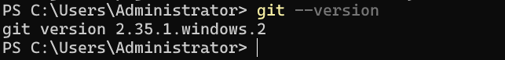
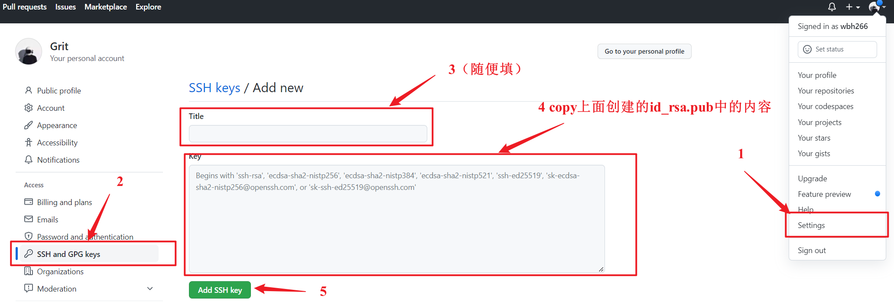
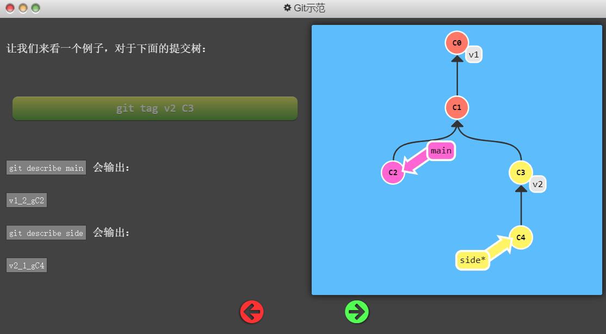

> 该文档为Git学习笔记，参考以下两个网站学习，与网站中内容颇为相似，只不过根据自己的理解和记忆特点进行了浓缩：
> 1. [Git操作可视化的学习网址](https://learngitbranching.js.org/?demo=&locale=zh_CN)
> 2. [廖雪峰的Git详细教程](https://www.liaoxuefeng.com/wiki/896043488029600)

[TOC]
## Git简介
&emsp;&emsp;Linus在1991年创建了开源的Linux操作系统，此后全球的业内人士共同向Linux操作系统贡献源码，不断升级优化，但刚开始大家贡献的源码都由Linus审核后人工手动录入，当时的Linus也考虑了使用版本控制系统，但一方面觉得SVN等免费的集中式版本控制系统不好用，还必须联网；另一方面觉得商用付费的版本控制系统与Linux的开源精神不符，就将这种状态拖了近10年。

&emsp;&emsp;经过10年发展的的Linux系统代码量很庞大了，鉴于全球开发者对这种状态的不满，Linus最终屈服于商业版的集中式版本控制系统，BitMover公司的BitKeeper，BitMover公司出于人道主义精神将其免费供Linux开源社区使用！直到有开发者试图破解BitKeeper并且被BitMover公司发现了，于是就给禁用了。

&emsp;&emsp;于是大神Linus花两周自己用C语言写了一个分布式版本控制系统——Git，一个月内，Linux源码就转由Git管理了！2008年，GitHub网站上线，免费提供Git存储，相当于一个免费服务器，此后至今，开源精神，星星之火呈燎原之势！

## 安装Git
### Linux平台下安装
直接在命令行运行`sudo apt-get install git`。
### Windows平台下安装
&emsp;&emsp;从[Git官网](https://git-scm.com/)直接下载Windows下的安装包，按默认步骤安装后系统中将出现Git Bash应用程序，可以在里边运行Git指令，也可以直接在Windows命令行运行Git。
### MacOS平台下安装
两种方式：
1. 先安装[homebrew](https://brew.sh/) ，再通过homebrew安装Git。
2. 直接从AppStore安装Xcode，Xcode集成了Git，不过默认没有安装，你需要运行Xcode，选择菜单“Xcode”->“Preferences”，在弹出窗口中找到“Downloads”，选择“Command Line Tools”，点“Install”就可以完成安装。
### 安装后的配置
在命令行使用`git`或者`git --version`检查是否安装成功。

&emsp;&emsp;因为Git是分布式版本控制系统，所以，每个机器都必须自报家门：你的名字和Email地址。命令行执行以下指令：
`git config --global user.name "your name"`
`git config --global user.email "your email"`
&emsp;&emsp;**注意git config命令的--global参数，用了这个参数，表示你这台机器上所有的Git仓库都会使用这个配置**，当然也可以对某个仓库指定不同的用户名和Email地址。
### 创建版本库
&emsp;&emsp;版本库可以简单理解为一个文件夹，git对这个文件夹内的所有文件进行版本管理。创建文件夹后在命令行中cd到该文件夹下执行`git init`即可。

&emsp;&emsp;注意所有的版本控制系统都只对文本文件进行管理，像图片视频等二进制文件，只能跟踪其大小变化但不知道文件具体改了什么，因此建议版本控制系统管理的文件都用纯文本格式编写，推荐使用UTF-8编码，关于编码格式的问题请阅读[常用编码格式区分](常用编码格式区分)。

## Git指令

### 版本管理系列

`git add readme.txt`
`git commit -m "提交的提示信息"`

`git diff readme.txt`：比较工作区和暂存区间的区别
`git diff --cached readme.txt`：比较暂存区和仓库间的区别
`git diff HEAD readme.txt`：比较工作区和仓库间的区别

`git status`
`git log [--pretty=oneline]`：查看提交历史
`git reflog`：查看执行命令历史

`git checkout -- readme.txt`：放弃工作区的修改，改为暂存区的文件状态，如果暂存区没有，就改为仓库中的状态，总之就是让工作区回到最近一次`git add`或者`git commit`的状态。
> 关于管理修改的问题，有以下三个常见场景
> 1. 当你改乱了工作区某个文件的内容，想直接丢弃工作区的修改时，用命令`git checkout -- file`。
> 2. 当你不但改乱了工作区某个文件的内容，还添加到了暂存区时，想丢弃修改，分两步，第一步用命令`git reset HEAD <file>`，就回到了场景1，第二步按场景1操作。
> 3. 已经提交了不合适的修改到版本库时，想要撤销本次提交，使用版本回退版指令`git reset --hard HEAD^`，不过前提是没有推送到远程库。

==注意==上面的`git checkout -- readme.txt`里面的`--`不能省略，不然就变成检出HEAD的状态了，git 2.23以上的版本取消了checkout这种身兼数职的状态，改为restore替代，即：
* `git checkout -- readme.txt` = `git restore readme.txt`：用于撤销工作区的修改。
* `git reset HEAD <file>` = `git restore --staged <file>`：用于撤销暂存区的修改，即文件已经add到暂存区但还未commit的状态。

==以下三条指令是直接管理仓库的版本历史：==
`git reset --hard HEAD^^`：回退2个版本，`HEAD`表示当前版本
`git reset --hard HEAD~5`：回退5个版本，`HEAD`表示当前版本
`git reset --hard ID号`：回到指定版本号的提交版本

关于恢复到之前的版本这种问题推荐阅读博客：[Git恢复之前版本的两种方法reset、revert（图文详解）](https://blog.csdn.net/yxlshk/article/details/79944535)

> 关于Git的三个分区：工作区----暂存区----仓库&emsp;&emsp;————廖雪峰评论
> &emsp;&emsp;本质上要分两个维度看，一个是数据，一个是记录。基于磁盘来看，数据就是我们要管理的代码本身。基于Git的管理来看，三个区本质上是管理的修改、暂存和提交的差异记录。不能说“提交后暂存区就没了”，这个是大家引起理解偏差的位置。
> 
> 工作区>>>>暂存区>>>>仓库
> 
> &emsp;&emsp;初始化完成后，三个区域都是空的，这个时候记录就算是初始化了，开始记录这三者差异。
> 
> &emsp;&emsp;在工作区创建一个新的文件test.txt，先add到暂存区，这时可以使用git diff来查看工作区和暂存区的差异（操作1），当然，这里肯定是没有差异的！记住，这里是比较差异，不存在哪个区的数据没有了或空了，因为数据只有一份。
> 
> &emsp;&emsp;然后，你在工作区对test.txt进行修改（并没有将暂存区提交到仓库），修改保存后，同样可以使用git diff来查看工作区和暂存区的差异（操作2），当然，这里肯定是有差异的！
> 
> &emsp;&emsp;在你并没有再次进行git add test.txt操作前，使用git commit将暂存区（第一次add的test.txt版本）提交到仓库，这时仓库就有了第一个版本的test.txt文件。
> 
> &emsp;&emsp;这时你同样可以使用git diff来查看工作区和暂存区的差异，和操作2的结果是不是一样的？对，是一样的。因为你并没有git add，工作区和暂存区数据存在差异。
> 
> &emsp;&emsp;这时你使用git diff --cached来查看暂存区和仓库的差异（操作3），当然，这里肯定是没有差异的！同样是因为你并没有再一次git add。
> 
> &emsp;&emsp;好了，你开始执行第二次git add，执行完后，再试试git diff操作，是不是发现没有差异了？可以证明这里确实比较的是工作区和暂存区的数据差异了吧！
> 
> &emsp;&emsp;好，再试试git diff --cached操作，是不是发现有差异了？也证明了这里确实比较的是暂存区和仓库的数据差异。
> 
> &emsp;&emsp;另外，我还想说一下git add的反向命令git checkout，就是将工作区提交到暂存区的数据撤销掉。以及git commit的反向命令git reset HEAD，就是将提交到暂存区的数据以仓库数据为基准撤销暂存。

> 关于`git diff`的使用&emsp;&emsp;&emsp;&emsp;——————硬着头皮呀评论
> 
> git diff 时是分为两种情况的：暂存区为空和暂存区不为空。
> 
> &emsp;&emsp;首先我们明确知道git diff是比较工作区和暂存区的文件的，如果此时暂存区为空，那么稍微有点不同，即：
> 1. 暂存区为空使用git diff：因为此时暂存区为空，此时使用git diff同样也是比较工作区和仓库，即和使用git diff HEAD结果相同
> 2. 暂存区不为空使用git diff:因为此时暂存区不为空，此时使用git diff比较的就是工作区和暂存区

关于删除文件的问题，需要先弄清楚下面两个指令的区别：
* `rm <file>`：这是Linux bash里面就有的指令，和git没关系，即使不在git管理下的文件夹中也可以执行这个操作，用来删除文件，等同于直接在文件资源管理器中删除文件，删除的是工作区的文件，此时用`git checkout -- filename`或者`git restore filename`是可以还原工作区的。
* `git rm <file>`：这个是git指令，必须在git管理下的文件夹中才能执行，不然会报错。该指令会删除工作区和暂存区的文件，即可以这么理解：**`git rm <file>` = `rm <file>`或者是先手动从文件资源管理器中删除文件，再执行`git add <file>`，也就是相当于是删除工作目录中的文件,并把此次删除操作提交到了暂存区**。想要还原的话，分为两种情况：
  * 如果此时提交到版本库了，即执行git rm后又执行了git commit，那就只能使用版本回退操作找回文件，即`git reset --hard HEAD^`；
  * 如果此时没有提commit，可以通过`git reset HEAD <file>`或者`git restore --staged filename`撤销对暂存区的修改，然后就可以使用`git checkout -- filename`把文件恢复到工作区。

### 远程仓库系列

#### 用前配置

&emsp;&emsp;使用远程仓库既可以找一台24小时开机的PC自己搭建一个Git仓库托管的服务器，但学习来说小题大做了，2008年发布的GitHub网址可以直接提供Git仓库托管服务，只要注册一个账号就可以了。

&emsp;&emsp;由于本地Git仓库和GitHub间的传输通过SSH加密进行，因此要先在GitHub中添加SSH密钥。按照如下步骤进行：
1. 先看看你的PC有没有SSH密钥，命令行执行`cd ~`切到你的用户主目录下，执行`ls -ah`找找有没有.ssh文件夹，有的话看看里面有没有id_rsa.pub和id_rsa公钥私钥对，有的话直接跳过下一步，进入步骤3。
2. 在命令行运行`ssh-keygen -t -C "your e-mail"`，一路回车按照默认步骤进行。结束之后你的主目录里就有一对密钥了。
3. 在GitHub登录账号，进入设置界面，按照下图步骤操作：

#### 将本地库关联并推送到远程库

&emsp;&emsp;现在我们将本地Git仓库和GitHub上的远程仓库进行关联，实现两个仓库的同步，首先在GitHub中建立一个仓库，右上角“New Repository”填写仓库名，创建后，下面会有提示可以把本地仓库与之关联并把本地仓库的内容推送到远程仓库，并且给出了相应的指令直接复制到命令行执行。
`git remote add origin https://github.com/wbh266/MyWorkNote.git`
&emsp;&emsp;关联之后将本地仓库内容推送上去，命令行执行下面的指令推送master分支：
`git push -u origin master`：把master分支上的所有本地提交推送到远程库。推送时，要指定本地分支，这样，Git就会把该分支推送到远程库对应的远程分支上。-u参数把本地master和远程master分支关联起来，方便以后推送。
&emsp;&emsp;执行完上述命令后，GitHub中的内容已经和本地仓库中的内容一样了，此后只要本地修改并commit之后，就可以通过`git push origin master`将本地master分支上的提交同步到GitHub远程仓库中。
`git remote`：查看远程库信息。
`git remote -v`：查看远程库更详细的信息。
`git remote rm 远程库名`：删除与远程库间的联系，并没有实际删除，实际删除远程库需要登陆GitHub网站，从后台删除。

#### 从远程库克隆仓库到本地

&emsp;&emsp;在GitHub中创建库之后可以通过执行下面的命令将其克隆到本地：
`git clone 克隆地址`：既可以通过SSH协议克隆过来，也可以通过https协议克隆。
`git clone git@github.com:wbh266/testRepo.git`
`git clone https://github.com/wbh266/testRepo.git`

#### 更进一步的推送及抓取分支操作——多人协作

&emsp;&emsp;工作时并不是所有的分支都要往远程推送，正常远程有个master分支保存v1.0、v2.0...等大版本更新，还有个日常工作大家一起推送的分支，其他分支比如修复bug开发新功能等小分支是自己管理的，总之，具体要推送哪些分支视项目需求而定，通过下面的指令实现某一分支的推送。
`git push origin <要推送的本地分支名>`
现在比如远程库有master分支和dev分支，大家进行团队协作，在从远程库clone到本地时，默认只能看到本地的master分支，但是大家在dev分支上进行主要的开发工作。这时就需要在本地创建和远程分支dev对应的分支，或者说创建远程仓库origin的分支dev到本地，使用下面的指令：
`git switch -c dev origin/dev`
创建好后你就可以在本地dev分支上开展工作并时不时地将其推送到远程分支。但你可能会推送失败，因为你的同事先推送了他的提交导致你们的推送存在冲突，因此一般采用下面的流程进行团队协作开发：
1. 首先试图用`git push origin <本地分支名>`将你的本地分支推送到远程分支；
2. 若提示推送失败，说明远程分支比你现在工作所基于的分支要新，也就是说被别人更新过了，这时要先拉取远程分支到本地并合并最新的提交：
`git pull`
3. 若pull也失败了，提示`no tracking information`，说明你没有创建本地分支dev和远程分支origin/dev间的连接，这时要先建立连接：
`git branch --set-upstream-to=origin/dev dev`
4. 再执行pull操作，有可能合并的时候会出现冲突，有冲突解决冲突，解决后提交，没有问题了就再次push。

### 分支管理系列

Git仓库创建时会自己创建一个主分支master，工作时一般先新建属于自己的分支，在该分支上完成工作后将其合并到主分支，之后删除自己的分支。
`git branch FixBug`：新建分支FixBug
`git checkout FixBug`：切换到FixBug
`git checkout -b FixBug`：用了-b参数，等于上面两步操作，新建并切换到该分支。
`git branch`：列出当前所有分支，当前选中的分支前面会有*号标记。
上面的FixBug分支中的工作完成后，切换回master分支，然后执行下面命令将FixBug分支合并到主分支：
`git merge FixBug`：merge命令将指定分支合并到当前分支。该指令只对当前分支产生影响，无论合并操作是否存在冲突，合并之后FixBug分支都没有任何变化。
> 合并分支时，加上--no-ff参数就可以用普通模式合并，合并后的历史有分支，能看出来曾经做过合并，而fast forward合并就看不出来曾经做过合并。
再删除自己的分支：

`git branch -d FixBug`：-d参数删除分支。
`git branch -D FixBug`：-D参数强制删除还没有合并的分支。

`git branch -f main HEAD~3`：将main分支移动到HEAD的第三级父提交，-f实现分支的移动。

现在比较新的Git版本一般使用switch指令进行分支的切换。
`git switch FixBug`：切换到分支FixBug
`git switch -c FixBug`：新建并切换到分支FixBug

`git log --graph`：--graph参数可以查看分支的合并情况

> 在实际开发中，我们应该按照几个基本原则进行分支管理：
> * 首先，master分支应该是非常稳定的，也就是仅用来发布新版本，平时不能在上面干活；
> * 那在哪干活呢？干活都在dev分支上，也就是说，dev分支是不稳定的，到某个时候，比如1.0版本发布时，再把dev分支合并到master上，在master分支发布1.0版本；
> * 你和你的小伙伴们每个人都在dev分支上干活，每个人都有自己的分支，时不时地往dev分支上合并就可以了。所以，团队合作的分支看起来就像这样：
> 

`git stash`：将未完成的现场工作压栈，主要所有被压栈的都要是被追踪的，即不能是新建文件还没有add过的。
`git stash list`：查看被压栈的现场
`git stash pop`：恢复现场
`git stash apply stash@{0}`：恢复指定的stash
`git cherry-pick <commit_id>`：复制一个指定提交到当前位置(HEAD)的下面。

### 标签管理系列

标签可以理解为为某一次提交打上一个注释。打标签很简单，先切换到要打标签的分支，然后：
`git tag <标签名称>`：没有标明commit_id的话就默认打在最新一次的提交上。
`git tag <标签名称> <commit_id>`：在指定commit处打标签。

`git tag`：查看所有标签，注意显示出来的标签不是按照时间顺序排列的，而是按照字母顺序。
`git show <标签名称>`：展示某个标签的具体信息
还可以为标签添加说明信息，执行以下指令：
`git tag -a <标签名称> -m "标签说明信息" <commit_id>`
`git describe <ref>`：<ref>指的是任何能被Git识别成提交记录的引用，未指定则默认为当前检出位置(HEAD)。它输出的结果是这样的：`<tag>_<numCommits>_g<hash>`，其中tag 表示的是离 ref 最近的标签， numCommits 是表示这个 ref 与 tag 相差有多少个提交记录， hash 表示的是你所给定的 ref 所表示的提交记录哈希值的前几位，当 ref 提交记录上有某个标签时，则只输出标签名称。如下图所示：

`git tag -d <标签名称>`：删除添加的本地标签。
打的标签都是存储在本地的，如果要推送标签到远程，执行以下命令：
`git push origin <标签名称>`：推送指定标签到远程。
`git push origin --tags`：推送本地的所有标签到远程。
`git push origin :refs/tags/<标签名称>`：可以删除一个远程标签。

### Git个性化配置
在.git目录下有config文件，其中内容实现对Git的个性化配置。
`git config --global color.ui true`：给文件名标上颜色。
`git config --global alias.别名 原名`：为指令配置别名

#### 忽略指定文件

&emsp;&emsp;当工作目录需要存放某些文件但又不能提交他们时（比如数据库密码、一些配置文件等），总会显示“untracked files”，此时可以通过编写“.gitignore”文件实现Git管理对某些文件的忽略。
&emsp;&emsp;“.gitignore”文件不需要自己从头编写，GitHub为我们提供了很多编写好的配置文件，我们拿过来组合改改即可，参见网址[GitHub提供的.gitignore文件](https://github.com/github/gitignore)，编写完成后把该文件add到版本库里进行管理即可。
&emsp;&emsp;有些时候，你想add一个文件到Git，但发现添加不了，原因是这个文件被.gitignore忽略了，命令窗口会提示你使用-f参数，强制将文件添加到Git。也可以通过下面的命令检查是“.gitignore”文件的哪一行规则忽略了要添加的文件，对其进行修改：
`git check-ignore -v <要添加的文件名>`
还可以通过为指定文件添加例外规则的方式解决该问题：
把指定文件排除在“.gitignore”规则外的写法就是“!+文件名”，所以，只需把例外文件添加进去即可。
`# 不排除.gitignore和App.class:`
`!.gitignore`
`!App.class`

### 其他

#### 一种常见情况-提交技巧

有时候做了提交，并基于此提交做了相关工作并再次提交了几次，但是后来发现需要修改之前的某一次提交，这时按照以下步骤进行：
1. 先用`git rebase -i 指定范围`将提交重新排序，把想要修改的提交记录放到最前面；
2. 再用`git commit --amend`修改最前面的提交记录，通过Vim修改；
3. 最后再使用`git rebase -i 指定范围`将提交顺序调整回原来的顺序。
4. 最后我们把 main 移到修改的最前端。

