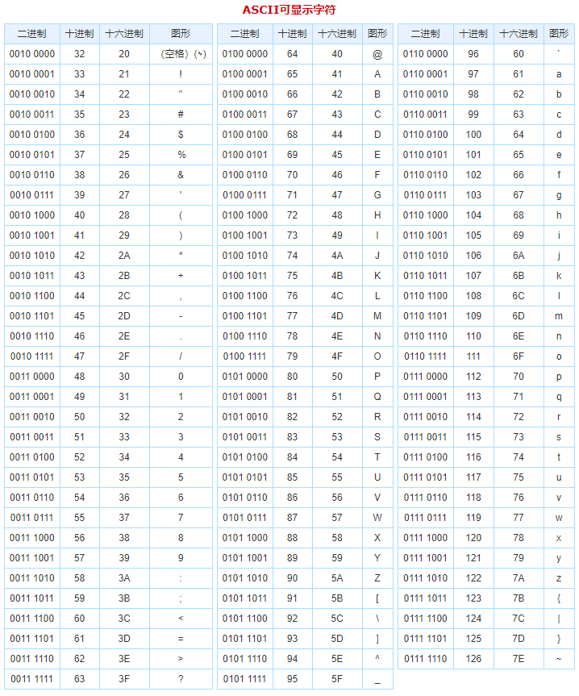

> 参考原文：
> [常用编码格式介绍](https://www.cnblogs.com/xiaojidanbai/p/10826472.html)
> [常见编码方式之间的区别](https://blog.csdn.net/HeatDeath/article/details/78620330)

## Ascii编码：

&emsp;&emsp;因为对于计算机来说只能识别0、1这两种字符（0表示低电平，1表示高电平），所有的数据都是通过二进制来表示，对于其他的比如说3、4、s、z、#等字符用二进制表示就需要一个约定的规范，这就是ascii的由来。

&emsp;&emsp;Ascii码表是用1个字节来表示128种字符（一个字节8位，可以组成256种字符，首位默认为0，所以ASCII最多就128个字符，当首位为1的时候我们后面再讨论），其中0-31和127表示控制字符，他们是不可见字符。

&emsp;&emsp;32-126是可见字符，48-57表示0-9，65-90为26个大写英文字母，97-122是26个小写英文字母。如下表所示：

## GBK编码:

&emsp;&emsp;现在英文和数字都有了，但是我们中国汉字怎么表示呢？此时GBK应运而生，上面我们得知ASCII首位为0，假如把它改成1，就表示中文。GBK由2个字节来表示，第一个字节的最高位是0则表示字母和数字，假如是1则表示中文。

## Unicode：

&emsp;&emsp;Unicode则是收录了世界上所有的语言， 但是在运用过程种会出现很多问题，比如一个3个字节的字符，如何区分他是1个unicode还是3个asicii，还有假如使用unicode，英文字母高位都会设置成0，这就造成了很大的浪费。因此UTF-8、UTF-16、UTF-32就出现来解决这些问题。

## UTF-8：

UTF-8的规则很简单就两条：

1. 对于单字节的字符，最高位为0，其实跟ascii表示一致
2. 对于n个字节的字符，第一个字节的最高位为n个1，第n+1设为0，后面每个字节的前两位都为10，剩下的用字符对应的unicode来表示，如下表：

| Unicode符号范围（十六进制） | UTF-8编码方式（二进制）             |
| --------------------------- | ----------------------------------- |
| 0000 0000-0000 007F         | 0xxxxxxx                            |
| 0000 0080-0000 07FF         | 110xxxxx 10xxxxxx                   |
| 0000 0800-0000 FFFF         | 1110xxxx 10xxxxxx 10xxxxxx          |
| 0001 0000-0010 FFFF         | 11110xxx 10xxxxxx 10xxxxxx 10xxxxxx |

## BCD：

&emsp;&emsp;BCD编码主要用于数字0-9的压缩，因为0-9二进制表示为0000 0000到0000 1001，它们的前4位都是0，把他们合并就生成一个新的字符。

&emsp;&emsp;比如2个字符’1’,’9’，他们对应的Ascii为0x31和0x39，因此表示形式则为2个字节0x31 0x39

&emsp;&emsp;假如用BCD格式来表示则将其数字对应的二进制前4位去掉，然后合并，即将00000001和00001001前4位去掉得到0001 1001，得到新的1个字节0x19,这样看起来就跟十进制一样，这就是BCD压缩码的原理。

## 其他总结

> * 中国人民通过对 ASCII 编码的中文扩充改造，产生了 GB2312 编码，可以表示6000多个常用汉字。
> * 汉字实在是太多了，包括繁体和各种字符，于是产生了 GBK 编码，它包括了 GB2312 中的编码，同时扩充了很多。
> * 中国是个多民族国家，各个民族几乎都有自己独立的语言系统，为了表示那些字符，继续把 GBK 编码扩充为 GB18030 编码。
> * 每个国家都像中国一样，把自己的语言编码，于是出现了各种各样的编码，如果你不安装相应的编码，就无法解释相应编码想表达的内容。
> * 终于，有个叫 ISO 的组织看不下去了。他们一起创造了一种编码 UNICODE ，这种编码非常大，大到可以容纳世界上任何一个文字和标志。所以只要电脑上有 UNICODE 这种编码系统，无论是全球哪种文字，只需要保存文件的时候，保存成 UNICODE 编码就可以被其他电脑正常解释。
> * UNICODE 在网络传输中，出现了两个标准 UTF-8 和 UTF-16，分别每次传输 8个位和 16个位。于是就会有人产生疑问，UTF-8 既然能保存那么多文字、符号，为什么国内还有这么多使用 GBK 等编码的人？因为 UTF-8 等编码体积比较大，占电脑空间比较多，如果面向的使用人群绝大部分都是中国人，用 GBK 等编码也可以。