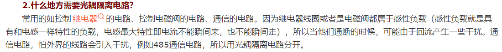
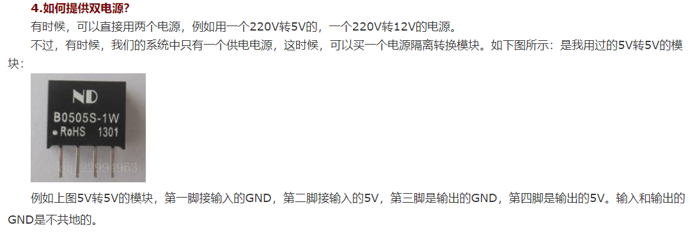

### 名词百科

1. **博世（Bosch）**
&emsp;&emsp;德国的一家工业企业，从事汽车、智能交通、工业技术、消费品及能源、建筑技术等领域，公司定位为“精密机械及电气工程的工厂”。世界500强企业，全球第一大汽车技术供应商，欧洲家电市场占有率第一的领导品牌。

1. **OEM（Original Equipment Manufacturer）**
&emsp;&emsp;委托其他厂家生产产品，再将其低价买断，并直接贴上自己的品牌商标，这种委托他人生产的合作方式简称OEM（即我们常说的“代工”），承接加工任务的制造商被称为OEM厂商（原始设备制造商），其生产的产品被称为OEM产品。

3. **ADI（Analog Devices, Inc）**
&emsp;&emsp;美国模拟器件公司，一般指亚德诺半导体技术有限公司，数据转换和信号处理技术全球领先的供应商，ADI的产品多用于模拟信号和数字信号的处理。

4. **电磁兼容性（Electromagnetic Compatibility, EMC）**
&emsp;&emsp;是指设备或系统在其电磁环境中符合要求运行并不对其环境中的任何设备产生无法忍受的电磁骚扰的能力。因此，EMC包括两个方面的要求：一方面是指设备在正常运行过程中对所在环境产生的电磁骚扰(Electromagnetic Disturbance)不能超过一定的限值；另一方面是指设备对所在环境中存在的电磁骚扰具有一定程度的抗扰度，即电磁敏感性(Electromagnetic Susceptibility，即EMS)。

### 专业知识点
**1. 光耦隔离**
&emsp;&emsp;结构：输入信号-发光器件  （光作为媒介）  光敏器件-输出信号
&emsp;&emsp;使输入输出之间传播媒介变为光控制，实现电-光-电的转换，隔离输入输出之间的电气连接，起到抗干扰的作用。

光耦隔离的两种常用方式：

**2. 磁耦隔离**
&emsp;&emsp;光耦体积大、功耗高、传输慢等缺陷制约着它在更高场合中的应用。磁耦合通过变压器隔离信号，ADI推出芯片级的磁耦合技术，即芯片级变压器，体积、功耗、使用方面都有光耦无法比拟的优势。

**3. 非屏蔽双绞线**
&emsp;&emsp;双绞线由8根颜色不同的线分4对绞合在一起，成对绞合的目的是尽可能的防止电磁辐射和外部电磁干扰，双绞线和分为屏蔽双绞线（STP，Shielded Twisted Pair）和非屏蔽双绞线（UTP，Unshielded Twisted Pair）两种。
&emsp;&emsp;UTP和STP的区别是有无金属屏蔽层，由于非屏蔽双绞线没有金属屏蔽层，所以造价相对便宜。安装屏蔽双绞线时，金属屏蔽层需要接地，但在实际施工中，很难做到全部完美接地，因此反倒使屏蔽层本身成为了最大的干扰源，使其性能远不如非屏蔽双绞线，所以除非特殊需要现在基本都是流行非屏蔽双绞线。
&emsp;&emsp;非屏蔽双绞线最早用于电话线，现在广泛用于计算机网络中，就是咱们常说的网线，UTP末端用RJ-45接头连接（常说的“水晶头”）。由于使用过长的UTP电缆传输数据会引致信号衰减问题，惟其价格较光纤和同轴电缆低，因此UTP主要用作短途传输，一般不多于100米。
&emsp;&emsp;双绞线的最大传输距离为 100m。如果要加大传输距离，在两段双绞线之间可安装中继器，最多可安装4个中继器。如安装4个中继器连接5个网段，则最大传输距离可达500m。

**4. 总线终端电阻**
1. 波长-频率-天线长短的关系：
    波长和频率的关系是倒数关系，具体的计算公式是：
    
* 150MHz的频率对应的波长为2m，因此150MHz左右的信号又称为“两米波”；
* 430MHz的频率对应的波长是0.7m，因此430MHz左右的信号又称为“70厘米波”；
==注：通过上面的公式可以看到，高频信号的波长短，低频信号的波长较长。==
&emsp;&emsp;天线的长短和波长成正比，因此高频信号对应的短波长使用的是天线；低频信号对应的波长较长，使用的天线的长度较长。
&emsp;&emsp;在涉及信号完整性和电源完整性时，需要考虑上述的传输线理论：
&emsp;&emsp;在低频时候，例如一个台灯的电源线长2米，其电源的工作频率是50Hz，波长就是6000公里。这根电源线相对于波长来讲是非常短的，不需要考虑波动效应，我们可以把它看成短路。
&emsp;&emsp;而对于一个便携式产品如手提电脑、PDA（Personal Digital Assistant，掌上电脑）等PCB板设计，假如工作频率在100MHz或者几个GHz，工作的波长和连接器的尺寸可以相互比拟，在连接器上面信号已经有明显的波动效应，这时必须考虑传输线效应。
2. 终端电阻
&emsp;&emsp;波动在传播时，在不同密度媒质的分界面会发生反射和折射，波在电缆中传输,遇到阻抗突变时就会反射,如传输线的尽头、传输线的不均匀都能引起波的反射，从而干扰原信号。
&emsp;&emsp;信号传输电路由于各种传输线都有其特性阻抗（以Twisted Pair 而言约为120Ω）。当信号在传输线中传输至终端时，如果它的终端阻抗和特性阻抗不同时，将会造成反射，而使信号波形失真。为了避免信号在传输线末端突然遇到电缆阻抗很小甚至没有，这种阻抗不连续的情况导致的反射波。就需要加上终端电阻。
&emsp;&emsp;终端电阻可以吸收网络上的反射波，有效地增强信号强度。两个终端电阻并联后的值应当基本等于传输线在通信频率上的特性阻抗。其终端匹配电阻值取决于电缆的阻抗特性，与电缆的长度无关。双绞线（屏蔽或非屏蔽）连接的信号传输线，终端电阻一般介于100至140Ω之间，典型值为120Ω。在实际配置时，在电缆的两个终端节点上，即最近端和最远端，各接入一个终端电阻，而处于中间部分的节点则不能接入终端电阻，否则将导致通讯出错。

**5. 共模、差模信号、共模扼流圈**
&emsp;&emsp;差模又称串模，指的是两根线之间的信号差值；而共模噪声又称对地噪声，指的是两根线分别对地的噪声。
&emsp;&emsp;差模信号（差模信号又称为常模、串模、线间感应和对称信号）：幅度相等，相位相反的信号，共模信号（又称为对地感应信号或不对称信号）：幅度相等，相位相同的信号。
&emsp;&emsp;对于一对信号线A、B，差模干扰相当于在A与B之间加上一个干扰电压，共模干扰相当于分别在A与地、B与地之间加上一个干扰电压；像平常看到的用双绞线传输差分信号就是为了消除共模噪声，原理很简单，两线拧在一起，受到的共模干扰电压很接近，于是两线间的电压差就近乎不计。

&emsp;&emsp;双绞线对外的干扰（EMI）：
* 对绞线中传输差模信号时
&emsp;&emsp;对纯差模信号而言，它在每一根导线上的电流是以相反方向在一对导线上传送。如果这一对导线是均匀的缠绕，这些相反的电流就会产生大小相等，反向极化的磁场，使它的输出互相抵消。在UTP中，不含噪音的差模信号不对外产生射频干扰。
* 对绞线中传输共模信号时
&emsp;&emsp;共模电流在两根导线上以相同方向流动，并经过寄生电容Cp到地返回。在这种情况下，电流产生大小相等极性相同的磁场，它们的输出不能相互抵消。共模电流在对绞线的表面产生一个电磁场，它的作用正如天线一样。在UTP中，共模信号对外产生射频干扰。

&emsp;&emsp;共模电感(Common mode Choke，CMC)，也叫共模扼流圈，常用于过滤共模的电磁干扰信号，共模扼流圈是将电源线的零线和火线（或回流线和信号线）同方向绕在铁氧体磁芯上构成的，它对线间流动的差模信号电流和电源电流阻抗很小，而对两根导线与地之间流过的共模电流阻抗则很大。

